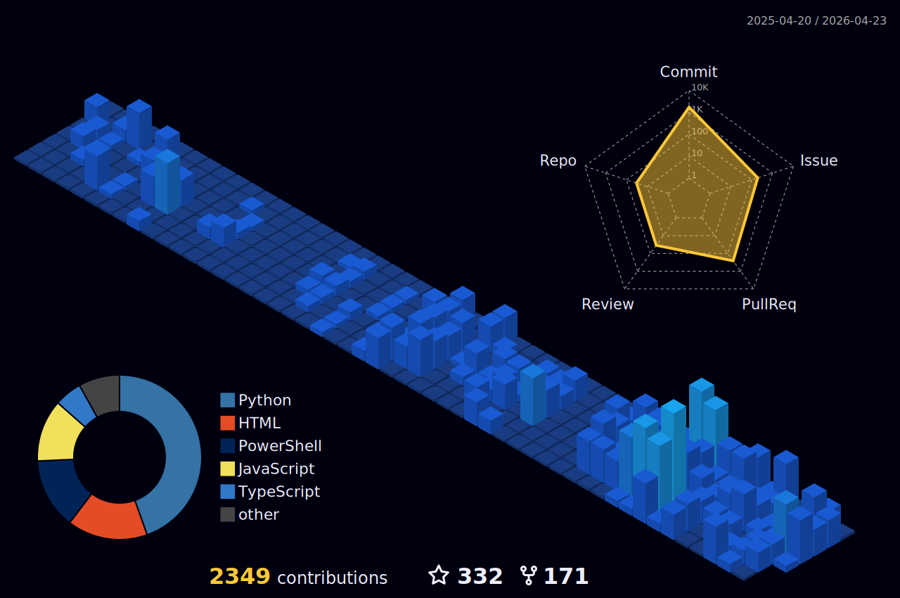

<p align="center">
  
</p>

<h1 align="center">
  
</h1>

<p align="center">
  
  
</p>

<p align="center">
  Welcome to my corner of the holonet, where I build clouds ☁️, architect solutions 🏗️, and occasionally debate the finer points of Azure Bicep vs. Terraform with my astromech droid.
</p>

<p align="center">
  <a href="https://www.linkedin.com/in/jonathanvella/"></a>
  <a href="https://jonathan-vella.github.io/"></a>
  <a href="https://github.com/jonathan-vella"></a>
</p>

---

## 📑 Table of Contents

- [🏆 GitHub Achievements](#-github-achievements)
- [📊 GitHub Stats & Activity](#-github-stats--activity)
- [🚀 Current Mission: Partner Success!](#-current-mission-partner-success)
- [🔭 What I'm Currently Working On](#-what-im-currently-working-on)
- [🛠️ Arsenal of Choice](#-arsenal-of-choice)
- [💪 Skills & Expertise](#-skills--expertise)
- [📂 Featured Projects](#-featured-projects)
- [📝 Latest Posts & Articles](#-latest-posts--articles)
- [🎲 Fun Fact](#-fun-fact)
- [🤖 AI Corner](#-ai-corner-my-digital-philosophy)
- [💭 Quote of the Moment](#-quote-of-the-moment)
- [📈 Contribution Graph](#-contribution-graph)
- [🐍 Watch My Contribution Snake Eat My Commits!](#-watch-my-contribution-snake-eat-my-commits)

---

## 🏆 GitHub Achievements

<p align="center">
  <a href="https://github.com/ryo-ma/github-profile-trophy">
    
  </a>
</p>

<p align="center">
  
  
  
  
</p>

<p align="center">
  
  
  
  
</p>

<p align="center">
  <sub>🏅 <em>Achievements unlocked through open source contributions!</em></sub>
</p>

---

## 📊 GitHub Stats & Activity

<p align="center">
  <picture>
    <source media="(prefers-color-scheme: dark)" srcset="https://github-readme-stats-opal-omega-36.vercel.app/api?username=jonathan-vella&show_icons=true&include_all_commits=true&rank_icon=percentile&show=reviews,prs_merged,prs_merged_percentage,discussions_started,discussions_answered&exclude_repo=github-readme-stats,jonathan-vella&theme=tokyonight&hide_border=true&bg_color=0D1117&title_color=0078D4&icon_color=0078D4" />
    <source media="(prefers-color-scheme: light), (prefers-color-scheme: no-preference)" srcset="https://github-readme-stats-opal-omega-36.vercel.app/api?username=jonathan-vella&show_icons=true&include_all_commits=true&rank_icon=percentile&show=reviews,prs_merged,prs_merged_percentage,discussions_started,discussions_answered&exclude_repo=github-readme-stats,jonathan-vella&theme=default&hide_border=true&title_color=0078D4&icon_color=0078D4&text_color=24292F&bg_color=FFFFFF" />
    
  </picture>
  
</p>

<p align="center">
  <picture>
    <source media="(prefers-color-scheme: dark)" srcset="https://github-readme-stats-opal-omega-36.vercel.app/api/top-langs/?username=jonathan-vella&layout=donut&langs_count=8&size_weight=0.5&count_weight=0.5&exclude_repo=github-readme-stats,jonathan-vella&theme=tokyonight&hide_border=true&bg_color=0D1117&title_color=0078D4" />
    <source media="(prefers-color-scheme: light), (prefers-color-scheme: no-preference)" srcset="https://github-readme-stats-opal-omega-36.vercel.app/api/top-langs/?username=jonathan-vella&layout=donut&langs_count=8&size_weight=0.5&count_weight=0.5&exclude_repo=github-readme-stats,jonathan-vella&theme=default&hide_border=true&title_color=0078D4&text_color=24292F&bg_color=FFFFFF" />
    
  </picture>
</p>

---

## 🚀 Current Mission: Partner Success!

My primary directive at the Microsoft Jedi Order is to team up with our strategic partners and help them unlock the immense power of **Microsoft Azure**. Think of me as their Jedi Master through the cloud galaxy, armed with technical expertise and a holocron of reference architectures (that's constantly being updated, of course).

I spend my days (and sometimes nights, fueled by questionable amounts of caf ☕) diving deep into technical council meetings, ensuring our partners can leverage the Force of Azure to its fullest potential. I troubleshoot dark side anomalies 👾, strategize hyperspace deployments, and act as a bridge between partner needs and Microsoft's cloud capabilities.

---

## 🔭 What I'm Currently Working On

<table>
  <tr>
    <td>🤖</td>
    <td><strong>AI-Driven InfraOps</strong></td>
    <td>Automating cloud deployments using GitHub Copilot and custom agents</td>
  </tr>
  <tr>
    <td>🏗️</td>
    <td><strong>Enterprise Architecture</strong></td>
    <td>Architecting scalable Azure Landing Zones for strategic partners</td>
  </tr>
  <tr>
    <td>📚</td>
    <td><strong>Community Enablement</strong></td>
    <td>Developing hands-on workshops, demos, and technical guides</td>
  </tr>
  <tr>
    <td>🎓</td>
    <td><strong>Partner Success</strong></td>
    <td>Guiding partners through complex Azure and AI transformations</td>
  </tr>
  <tr>
    <td>☁️</td>
    <td><strong>Sovereign & Edge Cloud</strong></td>
    <td>Prototyping solutions with Azure Local and Edge AI technologies</td>
  </tr>
</table>

---

## 🛠️ Arsenal of Choice

<p align="center">
  
  
  
  
  
  
  
</p>

---

## 💪 Skills & Expertise

<table>
  <tr>
    <td width="50%" valign="top">
      <h3>🏗️ Architecture & Platform</h3>
      <p>
        <br>
        <br>
        <br>
        
      </p>
    </td>
    <td width="50%" valign="top">
      <h3>🔐 Security, Identity & Enablement</h3>
      <p>
        <br>
        <br>
        <br>
        
      </p>
    </td>
  </tr>
</table>

---

## 📂 Featured Projects

<table>
  <tr>
    <td width="50%" align="center">
      <a href="https://github.com/jonathan-vella/azure-agentic-infraops">
        
      </a>
    </td>
    <td width="50%" align="center">
      <a href="https://github.com/jonathan-vella/azure-agentic-infraops-accelerator">
        
      </a>
    </td>
  </tr>
  <tr>
    <td width="50%" align="center">
      <a href="https://github.com/jonathan-vella/github-copilot-itpro">
        
      </a>
    </td>
    <td width="50%" align="center">
      <a href="https://github.com/jonathan-vella/azure-arc-enabled-sql-server">
        
      </a>
    </td>
  </tr>
  <tr>
    <td width="50%" align="center">
      <a href="https://github.com/jonathan-vella/microsoft-sovereign-cloud-brain-trek">
        
      </a>
    </td>
    <td width="50%" align="center">
      <a href="https://github.com/jonathan-vella?tab=repositories">
        
      </a>
    </td>
  </tr>
</table>

---

## 📝 Latest Posts & Articles

<table>
  <tr>
    <td width="50%" align="center" valign="top">
      <h3>📰 Articles</h3>
      <a href="https://www.linkedin.com/in/jonathanvella/recent-activity/articles/">
        
      </a>
      <br><sub>Deep dives, patterns, and architecture notes</sub>
    </td>
    <td width="50%" align="center" valign="top">
      <h3>📣 Activity Feed</h3>
      <a href="https://www.linkedin.com/in/jonathanvella/recent-activity/all/">
        
      </a>
      <br><sub>Updates, demos, and quick field insights</sub>
    </td>
  </tr>
</table>

---

## 🎲 Fun Fact

<p align="center">
  
</p>

When I'm not architecting in the cloud, you might find me:
- 🎮 Exploring retro video games
- 🏠 Experimenting with home automation
- ☕ Trying to convince my coffee machine to run on Azure Functions!

---

## 🤖 AI Corner: My Digital Philosophy

<div align="center">

```
╔═════════════════════════════════════════════════════════════════╗
║  AI_TERMINAL.EXE  v2026.02                                     ║
╠═════════════════════════════════════════════════════════════════╣
║  > boot message                                                 ║
║    "I don't replace infrastructure engineers with AI...         ║
║     I give them AI superpowers."                               ║
║                                                                 ║
║  > load stack                                                   ║
║    [OK] GitHub Copilot                                          ║
║    [OK] Azure OpenAI                                            ║
║    [OK] Custom Copilot Agents                                   ║
║    [OK] MCP Servers                                              ║
║                                                                 ║
║  > mission_2026.todo                                            ║
║    [ ] Deploy 100+ agentic workflows                            ║
║    [ ] Train partners on AI-powered IaC                         ║
║    [ ] Maximize automation, minimize manual drift               ║
║                                                                 ║
║  > status                                                       ║
║    READY ▓▓▓▓▓▓▓▓▓▓ 100%                                        ║
╚═════════════════════════════════════════════════════════════════╝
```

</div>

<p align="center">
  
  
  
</p>

<details>
<summary>💬 <strong>What would my AI twin say about infrastructure?</strong></summary>

<br>

```python
def jonathan_ai_wisdom():
    """
    Simulating Jonathan's brain on infrastructure decisions...
    """
    principles = [
        "If you're doing it twice, automate it",
        "Bicep > clicking buttons in the portal",
        "The best infrastructure is the one you don't have to think about",
        "Every manual deployment is a bug waiting to happen",
        "AI agents are not replacing us, they're our new teammates"
    ]

    return random.choice(principles) + " ☁️"

# Output: "Bicep > clicking buttons in the portal ☁️"
```

</details>

---

<details>
<summary>🎮 <strong>Click to Unlock Secret Achievement!</strong></summary>

<br>

<p align="center">
  
</p>

```
🏆 ACHIEVEMENT UNLOCKED: Jedi Master of the Cloud!
━━━━━━━━━━━━━━━━━━━━━━━━━━━━━━━━━━━━━━━━

    You found the secret section!

    Here's a virtual high-five: 🖐️

    And some cloud architect wisdom:

    "The cloud is just someone else's computer...
     ...that you've meticulously architected
     with 47 Bicep templates and the power of the Force."

    Fun Easter Eggs Found: 1/??? 👀

━━━━━━━━━━━━━━━━━━━━━━━━━━━━━━━━━━━━━━━━
```

<p align="center">
  <strong>🎉 Congrats! You're officially a certified profile explorer! 🎉</strong>
</p>

</details>

---

## 💭 Quote of the Moment

<p align="center">
  
</p>

<p align="center">
  
</p>

> "Cloud computing is not about saving money, it's about spending money wisely on a platform that allows you to innovate faster."
> <sub>— Someone Wise (Probably Architecting in the Cloud)</sub>

---

## 📈 Contribution Graph

<p align="center">
  
</p>

<p align="center">
  
</p>

---

## 🐍 Watch My Contribution Snake Eat My Commits!

<picture>
  <source media="(prefers-color-scheme: dark)" srcset="https://raw.githubusercontent.com/jonathan-vella/jonathan-vella/output/github-contribution-grid-snake-dark.svg" />
  <source media="(prefers-color-scheme: light)" srcset="https://raw.githubusercontent.com/jonathan-vella/jonathan-vella/output/github-contribution-grid-snake.svg" />
  
</picture>

<p align="center">
  <sub>🐍 <em>This snake automatically updates daily via GitHub Actions!</em></sub>
</p>

---

<div align="center">

### 🌟 If you find my work interesting, give it a ⭐!

<p align="center">
  
</p>

</div>

---

<p align="center">
  
</p>

<p align="center">
  <em>✨ This README was crafted with a little help from GitHub Copilot—because even cloud architects need a copilot! ✨</em>
</p>

<p align="center">
  <strong>&copy; 2026 Jonathan Vella</strong><br>
  <em>Powered by Microsoft Azure ☁️ and an unhealthy obsession with clean architecture 🏗️</em>
</p>

<p align="center">
  <sub>Made with ❤️ and ☕</sub>
</p>
