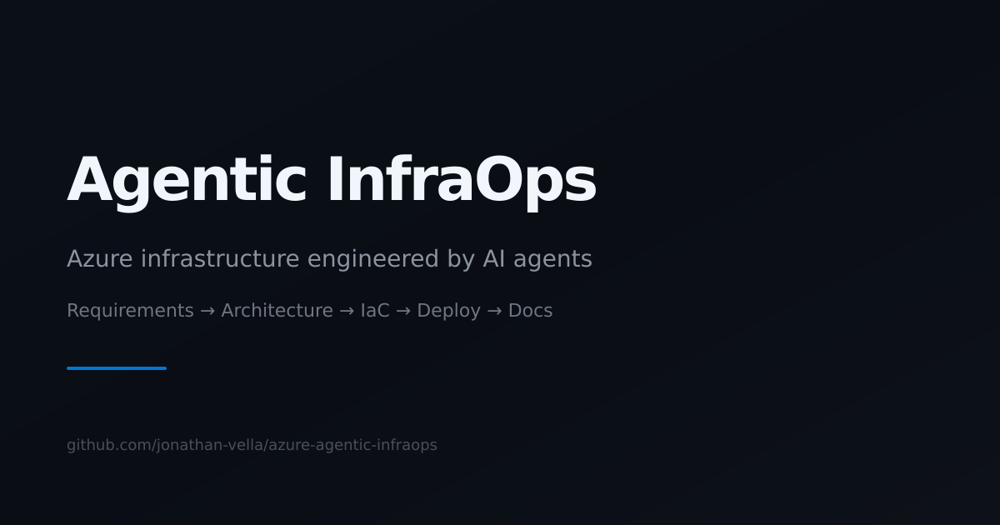
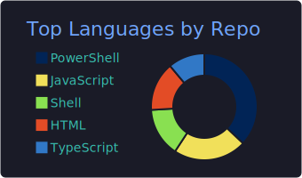
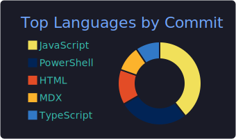
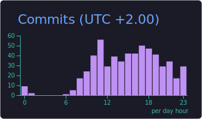

  

  <strong>Part Azure Jedi ⚔️, part InfraOps automator.</strong> I help partners turn Azure ambitions into deploy-ready reality — and build the agentic tooling that gets them there.

  Azure · Infrastructure as Code · AI-driven InfraOps · Sovereign &amp; Edge Cloud · Based in Malta 🇲🇹

  
  
  
  

---

## 🚀 What I'm building — APEX

  

**[APEX](https://github.com/jonathan-vella/apex)** is an *Agentic Platform Engineering eXperience* for Azure — a multi-agent workflow that turns plain-language infrastructure intent into deployable **Bicep or Terraform**, with human approval gates across the whole lifecycle.

> **AI prepares. Humans decide.** Every requirement, architecture, and plan is drafted and challenged by AI, then approved by a human before anything ships.

  
  
  

```mermaid
flowchart LR
    I([Describe intent]) --> R[Requirements]
    R --> A[Architecture<br/>WAF + Cost]
    A --> P[IaC Plan<br/>+ Governance]
    P --> G[Bicep / Terraform<br/>codegen]
    G --> D[Deploy]
    D --> B[As-Built docs]
    classDef step fill:#161b22,stroke:#0078d4,color:#f0f6fc;
    class I,R,A,P,G,D,B step;
```

  🔎 <a href="https://apexops.pro/demo/">See the end-to-end demo</a> · 🧪 <a href="https://microhack.apexops.pro/">Try the MicroHack</a> · 🧰 <a href="https://github.com/jonathan-vella/apex-accelerator">Start from the Accelerator</a>

---

## 🔭 What I'm working on

- 🤖 **AI-driven InfraOps** — agentic pipelines that plan, generate, and govern Azure IaC with GitHub Copilot
- 🤝 **Partner enablement** — guiding Microsoft partners through complex Azure &amp; AI transformations
- ☁️ **Sovereign &amp; Edge Cloud** — prototyping with Azure Local and Edge AI
- 📚 **Community** — hands-on workshops, MicroHacks, and reference architectures

---

## 🛠️ Stack

  
  
  
  
  
  
  

---

## 📂 More featured work

<table>
  <tr>
    <td valign="top" width="50%">
      <h4>🧰 <a href="https://github.com/jonathan-vella/apex-accelerator">apex-accelerator</a> &nbsp;</h4>
      Starter template for APEX — custom Copilot agents, an Azure Pricing MCP server, and an orchestrated multi-step workflow.
    </td>
    <td valign="top" width="50%">
      <h4>🛡️ <a href="https://github.com/jonathan-vella/microsoft-sovereign-cloud-brain-trek">microsoft-sovereign-cloud-brain-trek</a> &nbsp;</h4>
      Master Sovereign Cloud, Azure Local, and Edge AI — a learning journey for architects and solutions professionals.
    </td>
  </tr>
  <tr>
    <td valign="top" width="50%">
      <h4>🗄️ <a href="https://github.com/jonathan-vella/azure-arc-enabled-sql-server">azure-arc-enabled-sql-server</a> &nbsp;</h4>
      Tools, scripts, and guidance for SQL Server enabled by Azure Arc.
    </td>
    <td valign="top" width="50%">
      <h4>🏗️ <a href="https://github.com/jonathan-vella/azure-smb-rf">azure-smb-rf</a> &nbsp;</h4>
      Azure accelerator for SMB migrations — policy-enforced, security-hardened, deployable with Bicep + AVM.
    </td>
  </tr>
  <tr>
    <td colspan="2" align="center">
      
    </td>
  </tr>
</table>

---

📊 <strong>GitHub stats &amp; activity</strong> — self-generated daily (click to expand)

 

  

  
  

  

  <picture>
    <source media="(prefers-color-scheme: dark)" srcset="https://raw.githubusercontent.com/jonathan-vella/jonathan-vella/output/github-contribution-grid-snake-dark.svg" />
    <source media="(prefers-color-scheme: light)" srcset="https://raw.githubusercontent.com/jonathan-vella/jonathan-vella/output/github-contribution-grid-snake.svg" />
    
  </picture>

  Cards regenerate daily via GitHub Actions — static SVGs committed to this repo, so nothing depends on a live card service.

---

  <em>May the Cloud be with you.</em> ⚔️☁️ &nbsp;·&nbsp; Crafted with a little help from GitHub Copilot

