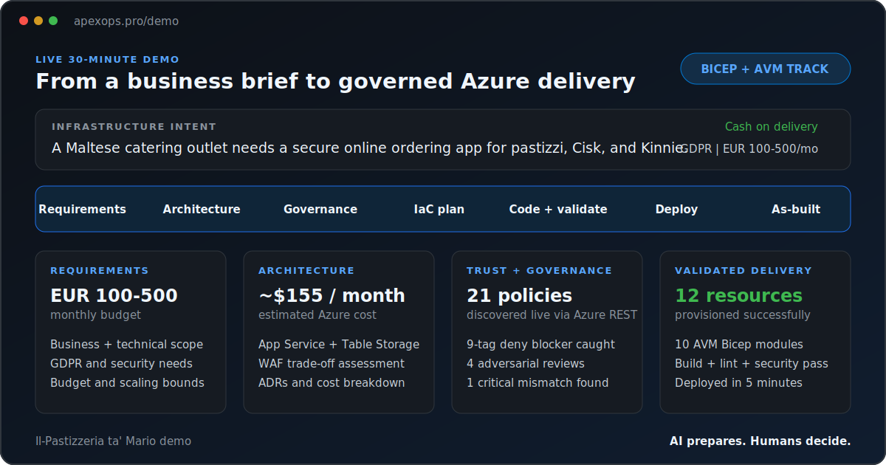

# Jonathan Vella

**Cloud Solutions Architect at Microsoft**

I work at the intersection of Azure platform engineering, Infrastructure as Code, and agentic AI—helping partners turn complex requirements into secure, governed, deployable platforms.

I also build the tooling behind that work. My current focus is [APEX](https://apexops.pro/), an agentic engineering workflow where AI prepares and humans decide.

[LinkedIn](https://www.linkedin.com/in/jonathanvella/) · [Website](https://jonathan-vella.github.io/) · [APEX](https://apexops.pro/) · [Articles](https://www.linkedin.com/in/jonathanvella/recent-activity/articles/)

> *Turning cloud complexity into something less Sith-like.* ⚔️

---

## What I do

### 🏗️ Architect

Design Azure platforms, landing zones, governance, networking, and hybrid-cloud solutions that balance security, reliability, cost, and operational reality.

### 🤖 Build

Create agentic workflows and Infrastructure as Code with GitHub Copilot, Bicep, Terraform, Azure Verified Modules, and practical validation gates.

### 🤝 Enable

Help partners and engineers succeed through architecture guidance, workshops, MicroHacks, reference implementations, and reusable accelerators.

---

## Featured build: APEX

  

**[APEX](https://github.com/jonathan-vella/apex)**—the *Agentic Platform Engineering eXperience for Azure*—turns plain-language infrastructure intent into reviewed, deployable **Bicep or Terraform**.

**Intent → Requirements → Architecture → Governance → IaC → Deployment → Documentation**

What makes it different:

- Human approval gates before consequential actions
- Independent challenger agents that critique requirements, architecture, governance, and implementation
- Azure Well-Architected Framework assessment and live cost analysis
- Bicep and Terraform execution tracks
- Live Azure Policy discovery and governance-aware planning
- AVM-first code generation with build, lint, security, and deployment validation

The [live walkthrough](https://apexops.pro/demo/) follows a real workload through the complete pipeline in 30 minutes. It preserves the generated artifacts, policy findings, validation trail, adversarial reviews, and deployment evidence—not just a polished product narrative.

**Current Bicep E2E benchmark: 88/100 · Grade B**

[Explore the repository](https://github.com/jonathan-vella/apex) · [Follow the demo](https://apexops.pro/demo/) · [Try the MicroHack](https://microhack.apexops.pro/) · [Use the accelerator](https://github.com/jonathan-vella/apex-accelerator)

---

## Selected work

- **[APEX Accelerator](https://github.com/jonathan-vella/apex-accelerator)** — start an agent-governed Azure IaC project with the APEX workflow, custom Copilot agents, and Azure Pricing MCP integration.
- **[Sovereign Cloud Brain Trek](https://github.com/jonathan-vella/microsoft-sovereign-cloud-brain-trek)** — a practical learning journey through sovereign cloud, Azure Local, and Edge AI.
- **[Azure SMB Reference Framework](https://github.com/jonathan-vella/azure-smb-rf)** — a policy-enforced, security-hardened migration foundation built with Bicep and Azure Verified Modules.
- **[Azure Arc-enabled SQL Server](https://github.com/jonathan-vella/azure-arc-enabled-sql-server)** — tools, scripts, and guidance for managing hybrid SQL Server estates with Azure Arc.

---

## Now

- Making agentic infrastructure workflows more measurable, repeatable, and trustworthy
- Exploring disconnected Azure Local and Edge AI architectures
- Building hands-on partner workshops around AI-assisted platform engineering

---

<strong>GitHub activity</strong>

 

  
  

  Generated daily as static SVGs by GitHub Actions—no live stats service required.

---

  <em>May the Cloud be with you.</em> ⚔️☁️

